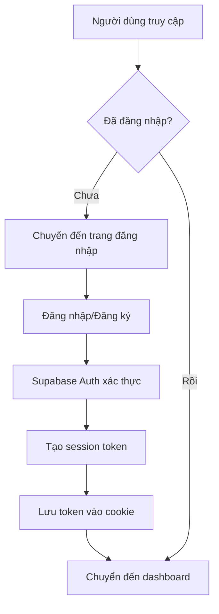
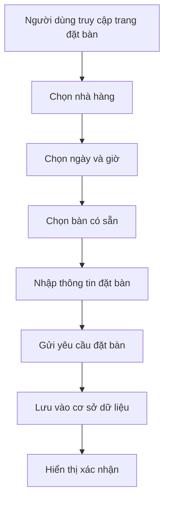
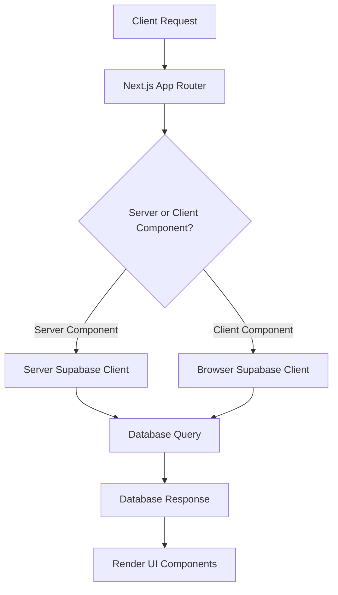

# Luồng hoạt động của dự án GOTA

## Tổng quan về kiến trúc

GOTA là hệ thống quản lý đặt bàn nhà hàng được xây dựng trên nền tảng Next.js và Supabase. Dự án tuân theo mô hình kiến trúc sau:

1. **Frontend**: Next.js App Router với React và TypeScript
2. **Backend**: Supabase (PostgreSQL) làm cơ sở dữ liệu và API
3. **Authentication**: Hệ thống xác thực người dùng qua Supabase Auth

## Luồng hoạt động chính

### 1. Xác thực người dùng

Luồng xác thực người dùng được quản lý thông qua Supabase Auth:



Xác thực được triển khai qua middleware (middleware.ts) và các utilities trong thư mục `/lib/supabase/`:

- `server.ts`: Tạo Supabase client phía server
- `client.ts`: Tạo Supabase client phía client (browser)
- `server-app.ts`: Tạo client cho server components

### 2. Quản lý đặt bàn

Quy trình đặt bàn:



### 3. Quản lý và hiển thị dữ liệu

Luồng quản lý dữ liệu:



## Các hàm chính và cách hoạt động

### Quản lý xác thực

Middleware (`middleware.ts`) xử lý việc kiểm tra xác thực và quản lý session:

```typescript
// Kiểm tra session và chuyển hướng nếu chưa đăng nhập
export async function middleware(request: NextRequest) {
  // Tạo Supabase client
  const supabase = createServerClient(/*...*/);
  
  // Kiểm tra người dùng hiện tại
  const { data: { user } } = await supabase.auth.getUser();
  
  // Chuyển hướng nếu chưa đăng nhập
  if (!user && !request.nextUrl.pathname.startsWith('/login')) {
    const url = request.nextUrl.clone();
    url.pathname = '/login';
    return NextResponse.redirect(url);
  }
  
  return NextResponse.next();
}
```

### Truy vấn cơ sở dữ liệu

Các hàm trong `lib/supabase/database.ts` cung cấp các phương thức truy vấn dữ liệu:

```typescript
// Lấy danh sách đặt bàn
export async function getReservations(filters?: { 
  userId?: string; 
  restaurantId?: number;
  tableId?: number;
  date?: string;
  status?: string;
}): Promise<Reservation[]> {
  const supabase = isClient ? createBrowserClient() : await createServerClient();
  let query = supabase.from('reservations').select('*');
  
  // Áp dụng bộ lọc
  if (filters) {
    if (filters.userId) query = query.eq('user_id', filters.userId);
    if (filters.restaurantId) query = query.eq('restaurant_id', filters.restaurantId);
    if (filters.tableId) query = query.eq('table_id', filters.tableId);
    if (filters.date) query = query.eq('reservation_date', filters.date);
    if (filters.status) query = query.eq('status', filters.status);
  }
  
  const { data, error } = await query.order('reservation_date', { ascending: true });

  if (error) {
    console.error('Error fetching reservations:', error);
    return [];
  }

  return data || [];
}
```

### Hiển thị dữ liệu

Các components trong thư mục `/app/dashboard/` và `/components/` hiển thị dữ liệu và tương tác với người dùng:

```typescript
// Ví dụ từ app/dashboard/reservations/page.tsx
export default function Page() {
  const [reservations, setReservations] = useState<Reservation[]>([]);
  
  useEffect(() => {
    async function fetchReservations() {
      try {
        const supabase = createClient();
        const { data, error } = await supabase.from('reservations').select('*');
        
        if (error) {
          console.error('Error fetching reservations:', error);
          return;
        }
        
        setReservations(data || []);
      } catch (error) {
        console.error('Error:', error);
      }
    }
    
    fetchReservations();
  }, []);
  
  return (
    <div>
      <h1>Reservations</h1>
      <ReservationTable data={reservations} />
    </div>
  );
}
```

## Mô hình dữ liệu

Các bảng cơ sở dữ liệu và mối quan hệ:

```
Users
  ├── id (PK)
  ├── email
  ├── name
  ├── phone_number
  ├── created_at
  ├── status
  └── role

Restaurants
  ├── id (PK)
  ├── name
  ├── start_time
  ├── end_time
  ├── created_at
  └── updated_at

Tables
  ├── table_id (PK)
  ├── restaurant_id (FK -> Restaurants.id)
  ├── table_number
  ├── capacity
  └── description

Reservations
  ├── reservation_id (PK)
  ├── user_id (FK -> Users.id)
  ├── restaurant_id (FK -> Restaurants.id)
  ├── table_id (FK -> Tables.table_id)
  ├── guest_count
  ├── reservation_date
  ├── start_time
  ├── end_time
  ├── created_at
  ├── status
  └── notes
```

## Luồng dữ liệu giữa frontend và backend

1. **Client-side rendering**: 
   - Components trong thư mục `/app` sử dụng `createClient` từ `lib/supabase/client.ts`
   - Dữ liệu được lấy và render phía client

2. **Server-side rendering**:
   - Server components sử dụng `createClient` từ `lib/supabase/server.ts`
   - Dữ liệu được lấy phía server và truyền đến components

3. **API Routes**:
   - Middleware xử lý xác thực
   - Supabase cung cấp các API tự động để thao tác với dữ liệu

## Tóm tắt flow

1. Người dùng truy cập hệ thống → Middleware kiểm tra xác thực
2. Người dùng đăng nhập → Supabase Auth xác thực → Tạo session
3. Người dùng truy cập dashboard → App Router điều hướng → Components render
4. Components gọi các hàm truy vấn → Lấy dữ liệu từ Supabase → Hiển thị dữ liệu
5. Người dùng thực hiện thao tác → Cập nhật dữ liệu → Refresh UI 